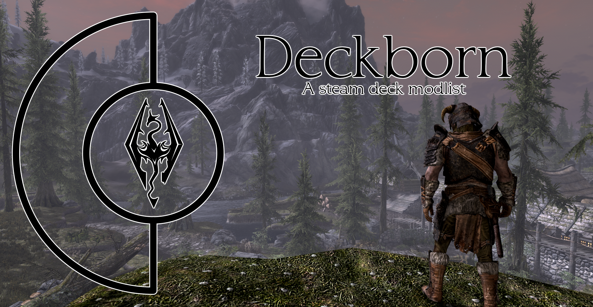

# Deckborn

# THIS LIST IS CURRENTLY NOT ACTIVE (WILL BE ACTIVE SOON)




A Skyrim AE modlist built around the Steam Deck!

- [Deckborn](#deckborn)
- [THIS LIST IS CURRENTLY NOT ACTIVE (WILL BE ACTIVE SOON)](#this-list-is-currently-not-active-will-be-active-soon)
- [Pre-Installation](#pre-installation)
    - [Requirements](#requirements)
    - [Setting up Skyrim](#setting-up-skyrim)
    - [Wabbajack Installation](#wabbajack-installation)
- [Installation](#installation)
  - [Steam Deck Installation](#steam-deck-installation)
    - [Running MO2](#running-mo2)
    - [Installing dependencies](#installing-dependencies)
- [Conclusion](#conclusion)


# Pre-Installation

### Requirements
Here is a list of all things you need to install the list!

1. A copy of Skyrim SE on steam with the AE DLC.
2. 50gbs of storage. This includes both the downloaded files and the main modlist install.
3. The latest wabbajack version from their website.
4. [Microsoft Visual C++ x64](https://aka.ms/vs/17/release/vc_redist.x64.exe).
5. [.Net Runtime](https://dotnet.microsoft.com/en-us/download/dotnet/8.0/runtime).
6. Nexus Premium (Whilst not required it will speed up the install).

### Setting up Skyrim

You will need to reinstall skyrim from scratch. This is to ensure the game folder is clean and Wabbajack will have no issues sorting the files.

1. Go into steam, locate Skyrim Special Edition, Right click, Manage and Uninstall.
2. Locate where the game was installed prior to uninstallation and delete any remaining files.
3. Go to "C:\Users\YOURUSERNAME\Documents\My Games" and delete the "Skyrim Special edition" folder.
4. Now go back into steam and install Skyrim Special Edition once again. Make sure to install it somewhere other than a system controlled folder. So do not install it in Program Files.
5. Once installed you will need to run the game once, first to load user settings and then after that launch the main game. Once on the main menu select "Download" on the AE content pop up. If this does not show up straight away you do not have the AE DLC.
6. Once the download has completed you will be able to close the game and move onto the next step.

### Wabbajack Installation

Wabbajack is a simple program to get set up and shouldn't be too much of a hassle even if you have never heard about it before. 

1. Firstly head to the [Wabbajack Download Page](https://www.wabbajack.org) and download the .exe to a location that is not a system controlled folder. I usually choose a folder I call "Bethesda Modding" on a seperate drive.
2. Once you have the .exe in its own folder "G:\Bethesda Modding\Wabbajack". You can run the program.
3. Once the application loads you will need to configure some settings. 
4. At the top right there will be a cog icon, click that.
5. From there find the "Logins" Tab and login into nexus mods with your account.
6. Wabbajack should be now configured!

# Installation

Now we can get to the good bit!

Follow these steps for greatness.

1. Open Wabbajack.
2. On the main screen click "Browse Modlists".


3. Tick "Show Unofficial Lists".
4. Search for "Deckborn".
5. Click the download icon on the card.
6. Once the download has finished click the play icon on the same card.
7. Now you will have some boxes to fill out .
8. The "Target Modlist" will auto fill so do not worry about that.
9. "Modlist Installation Location" Is where the actual list gets installed. So wherever you set this the mod list will end up after the installation.
10. "Resource Download Location" is where all the downloaded files get stored. So you can put this somewhere else if you need to like and external drive!
11. After this has been filled out just press the Play button to start the installer!

Now if all goes well the list should install without a problem, however as all things tech related, errors are bound to occur. If this does happen please join the Discord to get installation support. 

## Steam Deck Installation

Continue here if you want to install this list onto the steam deck.

You will still need to complete the main installation portion of the guide.

1. Copy the mod list installation to an external drive. Any other method of copying the list to the steam deck works just an external drive is easiest in my opinion.
2. Once the list is copied over you can place it anywhere on the steam deck, SSD or SD card are fine. But I would recommend that you either copy it to "/home/games" or anywhere on the SD card. 
3. Open steam in desktop mode.
4. Add a non steam game and locate the "modorganizer.exe" from the location you put the modlist.
5. Once added right click on the entry in steam and rename it to Deckborn.
6. Click "Compatibility" and force the use of "Proton Experimental".
7. Go back to the main shortcut settings scroll to launch options and input this "SteamDeck=0 %COMMAND%" If using an SD card also add "STEAM_COMPAT_MOUNTS=/run/media/mmcblk0p1".
8. Almost there. Now go into the discover store and install "Proton Tricks".
9. Once the install has finished use "Flatseal" or similar to ensure it has access to the SD Card If using it.

This Next section has been adapted from [Omni-guides'](https://github.com/Omni-guides/Wabbajack-Modlist-Linux/wiki/General-Linux-Guide-(Anvil)) General Linux tutorial so give them some love if you can!

1. Find the directory of the modlist. For example "/home/deck/Games/Skyrim/Deckborn"
2. Then open the terminal and run these 2 commands to change ownership to ensure you can control them: 
```
sudo chown -R deck:deck /home/deck/Games/Skyrim/Deckborn
```
and
```
sudo chmod -R 755 /home/deck/Games/Skyrim/Deckborn
```
Changing the directory as needed.

3. Whilst still in the terminal window run:
```
echo "alias protontricks='flatpak run com.github.Matoking.protontricks'" >> ~/.bashrc
```
To allow proton tricks to run from the command line.

4. And also run:
```
sudo flatpak override com.github.Matoking.protontricks --filesystem=/home/deck/Games

```
To make proton to access the file system where the modlist is installed, again change where needed.

### Running MO2

Now we can start running MO2

1. Click Play on the "Deckborn" entry in steam (Still in desktop mode)
2. You will get an error stating it failed to create a downloads folder. This is fine just close that window and reopen the Konsole
3. In the console run (sed -i "/download_directory/c\download_directory =" /home/deck/Games/Skyrim/Deckborn/ModOrganizer.ini) or wherever you mod list is installed
4. Now run Deckborn again from steam
5. A new error will occur where it cannot open the instance. Again this is ok and we just need to point MO2 to our instance. 
    1. Click ok on the error.
    2. Click Browse.
    3. Located the "Stock Game" folder in the mod list installation directory. For example "z:\home\deck\games\Skyrim\Deckborn\Stock Game".
    4. Then just click open.
    5. The splash screen for mo2 should now open!
6. A pop up for handling nxm links will show, just press yes and move on.
7. Once on the main mo2 screen opens head to the top bar and find the two cog icon that allows you to configure executables.
8. Then on the new menu click the "Deckborn" executable and go to the "Binary" tab.
9. Click the 3 dots at the end and navigate to "/LOCATION_OF_MODLIST/mods/SKSE/Root" Once there select skse64_loader.exe.
10. In the box below "Start in" click the 3 dots and navigate to the same directory "/LOCATION_OF_MODLIST/mods/SKSE/Root".

### Installing dependencies

Finally getting closer to finishing up. We just have to install some files to our wine prefix to get the list up and runnning and to future proof the directory for any future updates.

Again thanks to [Omni-Guides](https://github.com/Omni-guides/Wabbajack-Modlist-Linux) for compiling these commands

1. Since we set up proton tricks earlier we can now move onto a simple command thanks to Omni.
2. Open the console and run this command:
```
APPID=`protontricks -l | grep -i "Deckborn" | awk {'print $NF'} | sed 's:^.\(.*\).$:\1:'` ; protontricks --no-bwrap $APPID -q xact xact_x64 d3dcompiler_47 d3dx11_43 d3dcompiler_43 vcrun2022 dotnet6 dotnet7.
```
3. Let this command run for a while. It should take a fair few minutes but once done that all you need to do!.


# Conclusion

There we have it! You should now have a working install of Deckborn on either your PC or steam deck! 

Thanks for checking out the list and if you have any issues feel free to join the Discord linked at the top of this page. 

And again Thank you to Omni-Guides for the work done compiling commands to run!